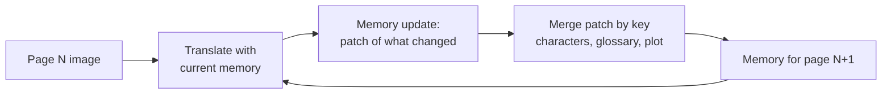

# Fukidashi: page-by-page manga translation that remembers

Case study for the Fukidashi hackathon project (Nebius Token Factory). Written for
judges and Nebius engineers; every number below comes from our own runs on the
OpenMantra test set.

## The problem

Manga is translated page by page, and a model with no memory treats every page as
its first: character names drift between pages and chapters, and a name that is
romaji'd one way on page 3 comes back differently on page 18. Worse, when we asked
the model to keep its own notes by rewriting the whole memory each page, it
gradually erased them — on `tencho_isoro` the glossary fell from 45 terms to 7 by
page 18. The model was not just forgetting; it was actively overwriting what it
had learned.

## What we built

A story memory the model updates after every page: characters, a glossary of
names, and open plot threads. Instead of rewriting the memory, the model sends
only a patch of what changed, and code merges the patch by key — so nothing is
silently lost between pages. The merged memory is fed back as context for the
next page's translation.

## Results

Test data: OpenMantra (Mantra Inc., CC BY-NC 4.0), which ships a professional
English reference. Test books follow Lippmann et al., COLING 2025:
`boureisougi`, `rasetugari`, `tencho_isoro` (130 pages, 944 lines). The metric is
pooled case-sensitive chrF under their protocol.

| setup | chrF | names match the professional translation (rasetugari / tencho / boureisougi) |
|---|---|---|
| Kimi-K3 with memory | 35.7 | 93% / 94% / 77% |
| Kimi-K3 no memory | 34.6 | 81% / 79% / 77% |
| Kimi-K3 no memory + previous page's lines | 34.2 | 78% / 85% / 74% |
| GLM-5.3-Flash with memory | 34.0 | – |
| GLM-5.3-Flash memory + Kimi-K3 translating | 33.8 | – |
| Lippmann et al. 2025, GPT-4 Turbo best | 36.8 | – |

The headline: **chrF barely moves (+1.1), but name fidelity jumps.** On
`rasetugari`, names matching the professional translation go from 81% to 93%; on
`tencho_isoro`, 79% to 94%.

Memory also carries across chapters. On `rasetugari` pages 28–54, seeding the
memory from pages 1–27 versus a cold start:

| | seeded (memory from ch. 1) | cold start |
|---|---|---|
| Starting confidence | 85 | 45 |
| Names right on the first 5 pages | 94% | 47% |
| chrF on the first 5 pages | 50.9 | 37.8 |

## Examples

Same line, same bubble (`imageUrl` + `id`), two runs. Format: Japanese |
professional reference | without memory | with memory.

From `rasetugari` (seeded run vs cold run):

| Japanese | Professional | Without memory | With memory |
|---|---|---|---|
| 在藤 | arifuji | Zaitou... | Arifuji |
| 宏也 | hiroya | Kouya | Hiroya |
| 華鏡丸ーー!! | kakyomaru--!! | KAKEIMARU!! | Kakyomaru—!! |

From `tencho_isoro` (memory run vs no-memory run):

| Japanese | Professional | Without memory | With memory |
|---|---|---|---|
| 店長! | Manager! | Boss! | Manager! |
| メルも自分の物何か買って来な? | so MEL, buy something for yourself. | Buy something for yourself too, Meru | so buy something for yourself, Mel. |
| メっ...!? | mel...!? | Me...!? | M-Mel...!? |

(Images `rasetugari/ja/027.jpg`, `028.jpg`, `029.jpg`; `tencho_isoro/ja/011.jpg`,
`012.jpg`, `036.jpg`.) The pattern repeats: without memory the same Japanese name
becomes `Zaitou`/`Kakeimaru`/`Kouya`/`Boss`/`Meru`/`Me`; with memory it matches
the professional translation.

## What did not work

- **Cheap-model memory.** GLM-5.3-Flash maintaining the memory for Kimi-K3
  scored 33.8 — below Kimi-K3 with its own memory (35.7). The memory writer
  needs to be the strong model.
- **Previous page's lines.** Feeding the model the last page's text instead of a
  memory scored 34.2, with worse name fidelity on two of three books (78% /
  85% / 74%). Recency is not memory.
- **The second pass.** An optional second translation pass changed 0 lines in
  148 pages. We dropped it.

We also want to be honest about the chrF number: the +1.1 gain is within
run-to-run noise. The reliable gain is in names, where the professional
reference gives us ground truth.

## Cost

Per 36–40 page book (Kimi-K3):

- With memory: about **$1.0** after the glossary fix (down from $1.5–2.4 when
  the model rewrote the whole memory each page).
- Without memory: about **$0.3**.
- GLM-5.3-Flash end to end: about **$0.05**.

Memory roughly triples token cost over no-memory, but the memory itself shrinks
once patching replaced full rewrites.

## Next steps

1. **Story memory inside the app** — expose the memory (characters, glossary,
   plot threads) in the UI so users can inspect and edit what the model knows.
2. **Chapter carry-over in the UI** — surface the seeded-memory flow
   (chapter 1 → chapter 2) as a first-class action, since it is the single
   biggest quality lever we measured.

## Code and data

- Code: [IlyaGusev/fukidashi PR #18](https://github.com/IlyaGusev/fukidashi/pull/18)
- Related work: Lippmann et al., *"Context-Informed Machine Translation of Manga
  using Multimodal LLMs"*, COLING 2025
  ([aclanthology.org/2025.coling-main.232](https://aclanthology.org/2025.coling-main.232/));
  DelTA, ICLR 2025 ([arxiv.org/abs/2410.08143](https://arxiv.org/abs/2410.08143)),
  which also uses memory with proper-noun records.

Data credit: OpenMantra dataset (Mantra Inc.), CC BY-NC 4.0.
